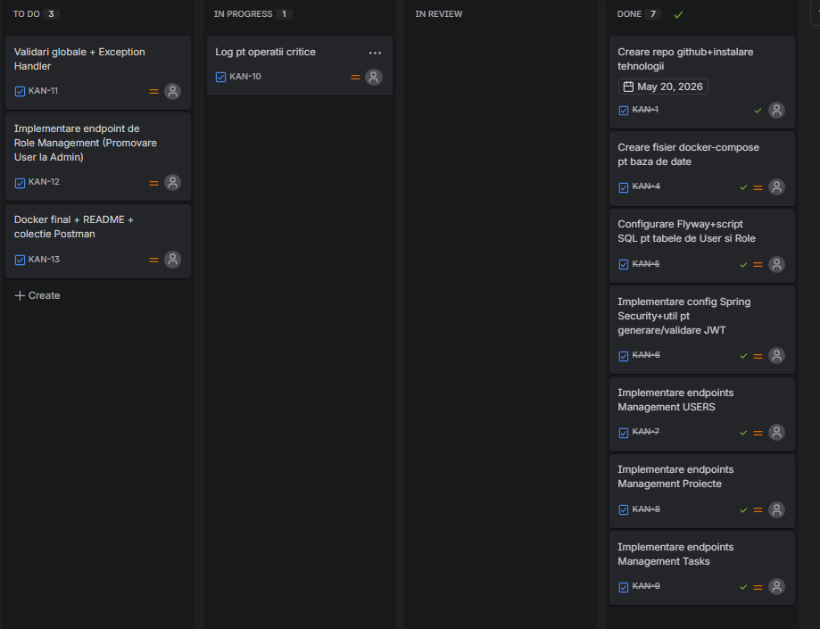

# Task Management Platform

[](https://spring.io/projects/spring-boot)
[](https://www.oracle.com/java/technologies/downloads/)
[](https://www.postgresql.org/)
[](https://www.docker.com/)

O aplicatie backend de nivel enterprise pentru managementul proiectelor si task-urilor intr-un mediu colaborativ. 
Aplicatia este concetrata pe optimizarea resurselor si securitate stateless prin token-uri.
Aceasta ajuta la buna desfasurare a workflow-urilor si a optimizarii procesului de lucru.

---

## Cuprins
1. [Managementul Proiectului prin Jira](#managementul-proiectului-prin-jira)
2. [Decizii Arhitecturale si de Design (Rationale)](#decizii-arhitecturale-si-de-design-rationale)
3. [Blocaje Tehnice si Solutii (Technical Roadblocks)](#blocaje-tehnice-si-solutii-technical-roadblocks)
4. [Matricea Functionalitatilor](#matricea-functionalitatilor)
5. [Stack Tehnologic](#stack-tehnologic)
6. [Ghid de Pornire Rapida (DevOps Integration)](#ghid-de-pornire-rapida-devops-integration)
7. [Kit de Testare API (Postman)](#kit-de-testare-api-postman)

---

## Managementul Proiectului prin Jira

Pentru planificarea, urmarirea si lansarea versiunilor software s-a utilizat **Jira**. 
Task-urile au fost structurate in tichete specifice, documentand cerintele tehnice, in acest fel oferindu-se o imagine clara a proiectului.

Mai jos se regaseste o captura de ecran a board-ului Kanban utilizat in dezvoltare:




---

## Decizii Arhitecturale si de Design

In dezvoltarea acestei platforme, s-a pus accent pe adoptarea standardelor de industrie enterprise si pe decuplarea logicii de business de infrastructura.

### 1. Modelare `Set<User>` in Many-to-Many
* **Abordare:** Utilizarea colectiilor JPA de tip `Set` in locul `List` pentru relatia Many-to-Many dintre Proiecte si Membri.
* **Rationale:** Hibernate trateaza colectiile `List` in relatiile Many-to-Many intr-un mod ineficient, prin stergerea si re-insertie completa a randurilor la orice modificare. 
Alegerea `Set` asigura unicitatea membrilor intr-un proiect si optimizeaza operatiunile de inserare/stergere in tabela de legatura.

### 2. Strategia de Soft Delete
* **Abordare:** Implementarea Soft Delete prin flag-ul `deleted = true`.
* **Rationale:** In sistemele de management, hard-delete-ul este o operatiune distructiva care elimina complet tabela complet. 
S-a implementat o solutie bazata pe flag, unde obiectele sunt marcate ca sterse, dar raman fizic pe disc. Prin acest flag datele respective nu sunt vizibile in baza de date pt actiunile cu userii,dar sunt disponibile in memoria RAM.

---

## Blocaje Tehnice si Solutii

Dezvoltarea a implicat rezolvarea unor probleme specifice Spring Boot si Hibernate:

### Capcana Lombok `@Data` in Entitatile JPA
* **Problema:** S-a identificat o exceptie de `duplicate key` aruncata de PostgreSQL la adaugarea membrilor intr-un proiect, chiar daca user-ul nu se afla anterior in sistem.
* **Cauza:** `@Data` de la Lombok genereaza automat metodele `equals()` si `hashCode()` scanand toate campurile, inclusiv colectiile Lazy. 
Cand starea colectiei se modifica in memorie, codul hash se schimba. Hibernate nu mai recunostea membrii existenti si incerca sa re-insereze in baza de date randuri deja existente.
* **Solutia:** S-a eliminat complet `@Data` de pe entitati. S-a trecut la adnotari `@Getter`, `@Setter` si s-a configurat explicit `@EqualsAndHashCode(onlyExplicitlyIncluded = true)` raportat strict la **ID-ul unic** al entitatii.

### Recursivitatea Infinita in Serializarea JSON
* **Problema:** La interogarea unui task, serverul intra intr-un infinite loop de apeluri (task-ul apela proiectul parinte, proiectul parinte apela lista de task-uri si tot asa).
* **Solutia:** Integrarea `@JsonIgnoreProperties` pe proxy-urile de tip Lazy Load si izolarea contextului relational inainte ca obiectele sa fie serializate si trimise catre Controller.

---

## Matricea Functionalitatilor

Aplicatia este structurata in jurul a doua fluxuri principale, acoperind cerintele fundamentale de arhitectura enterprise, dar si logica de business avansata:

### Functionalitati Core (Standard)
* **Autentificare si RBAC Security:** Inregistrare si autentificare securizata prin JWT. Sistemul valideaza accesul pe baza de roluri (`ROLE_ADMIN`, `ROLE_USER`).
* **Management Utilizatori:** Functionalitati de gestionare a profilelor personale pentru useri, dar si unelte extinse pentru Administratori (listare globala, modificare roluri, dezactivare conturi).
* **Management Proiecte (Boundary Isolation):** Flux complet de actiuni (creare, modificare, stergere de tip Soft Delete). Utilizatorii sunt izolati la nivel de tenant: pot interoga sau vedea doar task-urile din proiectele unde sunt validati ca Owner sau Membri.
* **Management Task-uri:** Flux de actiuni complete (CRUD), incluzand schimbarea controlata a statusului (`TODO` -> `IN_PROGRESS` -> `DONE`), asignare membrii si filtrare dupa status sau prioritate.
* **Sistem de Validare si Tratare a Erorilor:** Implementarea unui Global Exception Handler (`@ControllerAdvice`) care intercepteaza erorile aplicatiei, valideaza request-urile si returneaza raspunsuri HTTP standardizate, acompaniate de status codes corecte.
* **Audit si Logging:** Inregistrarea si monitorizarea in consola (Loggers) a request-urilor importante, a erorilor de sistem si a operatiunilor critice (login, stergeri, operatiuni de date).

### Functionalitati Business Inteligente (Extra Features)
* **Checklist cu Progres Dinamic (KAN-14):** Un task parinte poate contine multiple subtask-uri. Sistemul intercepteaza orice actiune la nivel de subtask (adaugare, stergere sau comutare de stare/`toggle`) si ruleaza instant o formula matematica ce recalculeaza si actualizeaza procentul global de progres (0% - 100%) in baza de date.
* **Smart Workload Router (KAN-15):** Algoritm automat de delegare a sarcinilor bazat pe gradul de incarcare real al programatorilor. Proiectul este analizat in timp real, iar noul task este delegat automat membrului cu cele mai putine sarcini active (`TODO`, `IN_PROGRESS`). Include o regula de *Tie-Breaker* ce favorizeaza Owner-ul de proiect in caz de egalitate perfecta a volumului de munca.
* **Monitorizare Proactiva (KAN-13):** Implementarea unui Job Programat (Cron Job / `@Scheduled`) care ruleaza recurent in fundal. Acesta analizeaza starea task-urilor din sistem si ridica automat un flag de alertare (`NEEDS_ATTENTION` = true) pentru sarcinile blocate sau intarziate, usurand procesul de urmarire pentru managerii de proiect.
---

## Stack Tehnologic

* **Framework Principal:** Spring Boot 3.2.5
* **Limbaj de Programare:** Java 17
* **Sistem de Gestiune a Bazelor de Date:** PostgreSQL 15
* **Sistem de Migrare:** Flyway DB
* **Containerizare si Simulare Mediu:** Docker si Docker Compose
* **Utilitare:** Lombok
* **Securitate:** Suita io.jsonwebtoken

---

## Ghid de Pornire Rapida (DevOps Integration)

Aplicatia este containerizata complet. S-a utilizat un mecanism in Dockerfile pentru a compila codul si a rula aplicatia intr-un mediu izolat si securizat. 
Nu este necesara instalarea locala a Java sau Maven pe sistemul gazda.

### Pornirea aplicatiei (Deployment local)
Navigheaza in folderul radacina al proiectului si ruleaza in terminal:
```bash
docker compose up --build -d